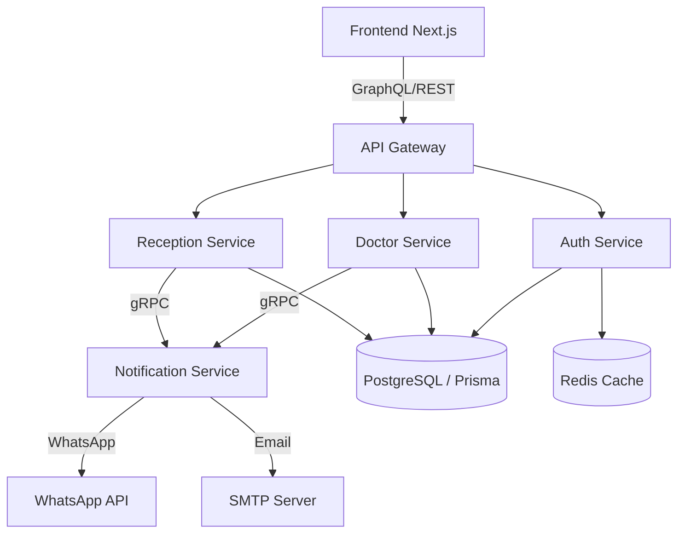

# 🏥 Plateforme de Gestion de Cabinet Médical (Clinic Management System)

[](https://nextjs.org/)
[](https://nodejs.org/)
[](https://microservices.io/)
[](https://graphql.org/)

Une solution logicielle de pointe, **full-stack et modulaire**, conçue pour transformer la gestion opérationnelle des cabinets médicaux. Cette plateforme optimise la communication entre les patients, le personnel de réception et les médecins grâce à une architecture distribuée et des notifications en temps réel.

---

## 📸 Aperçu de l'Interface

<div align="center">
  
  <p><em>Une interface moderne, intuitive et responsive.</em></p>
</div>

<div align="center">
  
  
</div>

---

## 🛠 Stack Technique (Modern Stack)

### 🎨 Frontend (Client Side)
- **Framework** : Next.js 15 (App Router)
- **Langage** : TypeScript
- **Styling** : Tailwind CSS & Framer Motion (pour les animations)
- **Gestion d'état & Data** : Apollo Client (GraphQL) & Axios
- **Internationalisation** : Système multilingue (FR/AR/EN) intégré.

### ⚙️ Backend (Server Side - Microservices)
L'infrastructure est découpée en services spécialisés pour une scalabilité maximale :
- **Gateway** : Point d'entrée unique pour le frontend.
- **Service Authentification** : Gestion des accès, JWT et sessions Redis.
- **Service Docteur & Réception** : APIs GraphQL dédiées pour la gestion métier.
- **Service Notification** : Service gRPC haute performance pour l'envoi de messages WhatsApp (via WhatsApp-web.js) et Emails.
- **ORM** : Prisma pour une gestion typée de la base de données PostgreSQL.

### 🗄️ Infrastructure & Outils
- **Bases de données** : PostgreSQL (Données relationnelles), Redis (Cache & Sessions).
- **Communication Inter-services** : gRPC (Protocol Buffers) pour une latence minimale.
- **Contrôle de version** : Git / GitHub.

---

## 🏗 Architecture du Système



---

## ✨ Fonctionnalités Principales

- **🔐 Sécurité Avancée** : Authentification multi-rôles sécurisée avec gestion des tokens de rafraîchissement.
- **📅 Gestion des Rendez-vous** : Calendrier interactif pour la réception et les médecins.
- **💬 Notifications Automatisées** : Confirmation et rappel de rendez-vous envoyés automatiquement par WhatsApp et Email.
- **📁 Dossier Patient Numérique** : Historique complet des consultations et documents médicaux.
- **🌐 Multilingue** : Interface adaptable instantanément selon la langue de l'utilisateur.
- **⚡ Performance** : Chargement ultra-rapide grâce au Server-Side Rendering (SSR) de Next.js.

---

## 📁 Structure du Projet

```text
├── backend/
│   ├── authentification/  # Gestion des utilisateurs & sécurité
│   ├── doctor/            # Logique métier côté médecin (GraphQL)
│   ├── gateway/           # API Gateway principal
│   ├── notf_srv/          # Service de notifications (gRPC)
│   ├── recep/             # Logique réceptionniste (GraphQL)
│   └── proto/             # Définitions gRPC (Protobuf)
├── frontend/
│   ├── app/               # Next.js App Router (UI & Pages)
│   ├── components/        # Composants React réutilisables
│   └── public/images/     # Ressources visuelles
└── README.md              # Documentation principale
```

---

## 🚀 Installation (Développement)

1. **Cloner le projet**
   ```bash
   git clone https://github.com/votre-repo/platforme-cabinet.git
   ```

2. **Configuration du Backend** (Répéter pour chaque microservice)
   ```bash
   cd backend/service_name
   npm install
   cp .env.example .env
   npx prisma generate
   npm run dev
   ```

3. **Configuration du Frontend**
   ```bash
   cd frontend
   npm install
   npm run dev
   ```

---

<div align="center">
  <p>Développé avec ❤️ pour moderniser le secteur de la santé.</p>
</div>
