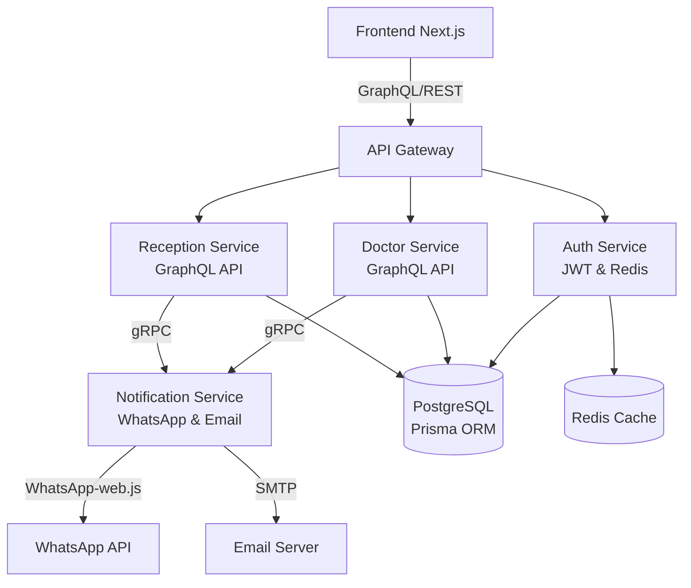

# 🏥 Plateforme de Gestion de Cabinet Médical

[](https://nextjs.org/)
[](https://nodejs.org/)
[](https://microservices.io/)
[](https://graphql.org/)

> Une solution logicielle full-stack et modulaire conçue pour moderniser la gestion des cabinets médicaux. Optimise la communication patient-médecin via une architecture distribuée et des notifications en temps réel.

---

## 📋 Table des Matières

- [Vision du Projet](#-vision-du-projet)
- [Technologies Utilisées](#-technologies-utilisées)
- [Architecture Système](#-architecture-système)
- [Fonctionnalités Principales](#-fonctionnalités-principales)
- [Structure du Projet](#-structure-du-projet)
- [Installation et Configuration](#-installation-et-configuration)
- [Utilisation](#-utilisation)
- [Contribution](#-contribution)
- [Licence](#-licence)

---

## 🎯 Vision du Projet

Cette plateforme révolutionne la gestion des cabinets médicaux en offrant une solution digitale complète qui améliore l'efficacité opérationnelle, la sécurité des données et l'expérience utilisateur. Inspirée par les défis réels des professionnels de santé, elle intègre les meilleures pratiques en matière de développement logiciel moderne, sécurité et scalabilité.

### Idées Clés
- **Digitalisation Complète** : Transformation numérique des processus administratifs et médicaux.
- **Communication Omnicanale** : Notifications automatisées via WhatsApp et email pour une meilleure engagement patient.
- **Sécurité Renforcée** : Authentification multi-facteurs et conformité RGPD.
- **Scalabilité** : Architecture microservices permettant une évolution facile du système.
- **Accessibilité** : Interface multilingue (FR/AR/EN) et responsive pour tous les appareils.

---

## 🛠 Technologies Utilisées

### Frontend (Client-Side)
- **Framework** : Next.js 15 avec App Router pour un rendu côté serveur optimisé.
- **Langage** : TypeScript pour une typage statique et une maintenabilité accrue.
- **Styling** : Tailwind CSS pour un design moderne et Framer Motion pour des animations fluides.
- **Gestion d'État** : Apollo Client pour les requêtes GraphQL et Axios pour les appels REST.
- **Internationalisation** : Support natif multilingue avec Next.js i18n.

### Backend (Server-Side - Microservices)
- **Architecture** : Microservices indépendants pour une scalabilité horizontale.
- **API Gateway** : Point d'entrée unifié gérant le routage et l'authentification.
- **Services Spécialisés** :
  - Authentification : JWT et sessions Redis.
  - Docteur/Réception : APIs GraphQL pour la logique métier.
  - Notifications : Service gRPC haute performance pour WhatsApp et email.
- **ORM** : Prisma avec PostgreSQL pour une gestion de base de données typée.
- **Communication** : gRPC avec Protocol Buffers pour une latence minimale inter-services.

### Infrastructure et Outils
- **Bases de Données** : PostgreSQL (données relationnelles), Redis (cache et sessions).
- **Conteneurisation** : Docker pour l'isolation et le déploiement.
- **Contrôle de Version** : Git avec GitHub pour la collaboration.
- **CI/CD** : Pipelines automatisées pour les tests et déploiements.

---

## 🏗 Architecture Système

L'architecture suit les principes des microservices pour assurer une séparation des préoccupations et une évolutivité.



### Flux de Données
1. Le frontend envoie des requêtes via l'API Gateway.
2. L'authentification est validée et les sessions gérées via Redis.
3. Les services métier (Docteur/Réception) traitent les données via GraphQL.
4. Les notifications sont envoyées de manière asynchrone via gRPC.

---

## ✨ Fonctionnalités Principales

- **🔐 Authentification Sécurisée** : Système multi-rôles avec tokens JWT et rafraîchissement automatique.
- **📅 Gestion des Rendez-vous** : Calendrier interactif avec synchronisation temps réel.
- **💬 Notifications Intelligentes** : Rappels automatiques via WhatsApp et email, personnalisables.
- **📁 Dossiers Patients Numériques** : Historique médical complet avec pièces jointes sécurisées.
- **🌐 Interface Multilingue** : Adaptation instantanée FR/AR/EN selon l'utilisateur.
- **⚡ Performance Optimisée** : SSR Next.js pour un chargement ultra-rapide.
- **📊 Tableaux de Bord** : Analytics en temps réel pour les médecins et administrateurs.
- **🔒 Conformité** : Respect des normes RGPD et sécurité des données médicales.

---

## 📁 Structure du Projet

```
cabinet-management-system/
├── backend/
│   ├── authentification/     # Service d'authentification
│   │   ├── src/
│   │   │   ├── controllers/  # Logique contrôleurs
│   │   │   ├── routes/       # Définition routes
│   │   │   └── utils/        # Utilitaires (tokens, validation)
│   │   ├── prisma/           # Schéma base de données
│   │   └── package.json
│   ├── doctor/               # Service médecin (GraphQL)
│   ├── gateway/              # API Gateway
│   ├── notf_srv/             # Service notifications (gRPC)
│   ├── recep/                # Service réception (GraphQL)
│   └── proto/                # Définitions Protocol Buffers
├── frontend/
│   ├── app/                  # Next.js App Router
│   ├── components/           # Composants React réutilisables
│   ├── public/               # Ressources statiques
│   └── package.json
├── docker/                   # Configurations Docker
├── docs/                     # Documentation API
└── README.md
```

---

## 🚀 Installation et Configuration

### Prérequis
- Node.js 20+
- PostgreSQL 15+
- Redis 7+
- Docker (optionnel)

### Étapes d'Installation

1. **Cloner le Repository**
   ```bash
   git clone https://github.com/votre-username/cabinet-management-system.git
   cd cabinet-management-system
   ```

2. **Configuration de la Base de Données**
   ```bash
   # Créer une base PostgreSQL
   createdb cabinet_db

   # Configurer Redis
   redis-server
   ```

3. **Installation des Dépendances Backend**
   ```bash
   # Pour chaque microservice
   cd backend/authentification
   npm install
   cp .env.example .env  # Configurer les variables d'environnement
   npx prisma migrate dev
   npx prisma generate
   ```

4. **Installation du Frontend**
   ```bash
   cd frontend
   npm install
   cp .env.local.example .env.local
   ```

5. **Démarrage des Services**
   ```bash
   # Terminal 1: API Gateway
   cd backend/gateway && npm run dev

   # Terminal 2: Auth Service
   cd backend/authentification && npm run dev

   # Terminal 3: Frontend
   cd frontend && npm run dev
   ```

### Configuration Docker (Optionnel)
```bash
docker-compose up -d
```

---

## 📖 Utilisation

1. Accéder à l'application via `http://localhost:3000`
2. Créer un compte administrateur
3. Configurer les profils médecins et réceptionnistes
4. Commencer à gérer les rendez-vous et patients

### Points d'Entrée API
- **Gateway** : `http://localhost:4000`
- **GraphQL Playground** : `http://localhost:4001/graphql`
- **Documentation API** : Voir le dossier `docs/`

---

## 🤝 Contribution

Les contributions sont les bienvenues ! Veuillez suivre ces étapes :

1. Forker le projet
2. Créer une branche feature (`git checkout -b feature/AmazingFeature`)
3. Commiter vos changements (`git commit -m 'Add some AmazingFeature'`)
4. Pousser vers la branche (`git push origin feature/AmazingFeature`)
5. Ouvrir une Pull Request

### Standards de Code
- Utiliser ESLint et Prettier
- Écrire des tests unitaires pour les nouvelles fonctionnalités
- Respecter les conventions de nommage TypeScript

---

## 📄 Licence

Ce projet est sous licence MIT - voir le fichier [LICENSE](LICENSE) pour plus de détails.

---

<div align="center">
  <p>Développé avec ❤️ pour révolutionner la gestion des cabinets médicaux.</p>
  <p>Pour toute question, contactez l'équipe de développement.</p>
</div>
